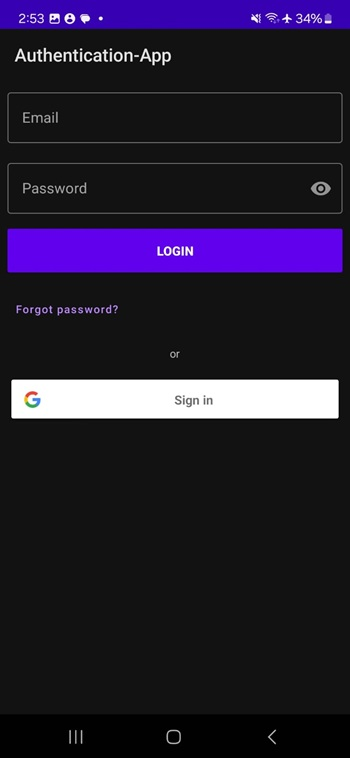

# Android authentication

An Android authentication library that supports APIs from an open-source [Authentication Server](https://github.com/jefryjacky/Authentication-Server)


[](https://jitpack.io/#jefryjacky/android-authentication)

**Gradle**
```  
dependencies {  
    ...  
    implementation 'com.github.jefryjacky.android-authentication:auth:v1.1.6'
}  
```  


## Features

- Login with email and password
- Login with Google account
- Register with email and password
- verify email by OTP
- verify email by link
- Register with Google account
- Forgot password and verify by email OTP
- Forgot password and verify by email link

```
class AuthenticationApp:Application() {

    override fun onCreate() {
        super.onCreate()
        // true for show chucker otherwise false
        AuthConfig.SHOW_API_INFO = true 
        // endpoint for hit authentication server
        AuthConfig.API = BuildConfig.AUTH_API 
        // authentication server API KEY
        AuthConfig.API_KEY = BuildConfig.API_KEY
        // google auth id for able to login with google account
        AuthConfig.GOOGLE_AUTH_ID = BuildConfig.GOOGLE_AUTH_ID
        // true if you want verify email by send verification link to user email
        AuthConfig.EMAIL_VERIFICATION_BY_LINK = false
        // true if you want verify email by send OTP code to user email
        AuthConfig.EMAIL_VERIFICATION_BY_OTP = true
        // true if you want change password and verify it by send verification link to user email
        AuthConfig.FORGOT_PASSWORD_BY_OTP = true
        // true if you want to chnge password and verify it by send OTP code
        AuthConfig.FORGOT_PASSWORD_BY_LINK = false
        // color for dark theme for jetpack compose UI
        AuthConfig.DARK_COLOR_SCHEME = DarkColorScheme
        // color for light theme for jetpack compose UI
        AuthConfig.DARK_COLOR_SCHEME = LightColorScheme
        // typography for jetpack compose UI
        AuthConfig.Typography = Typography
    }
```

)